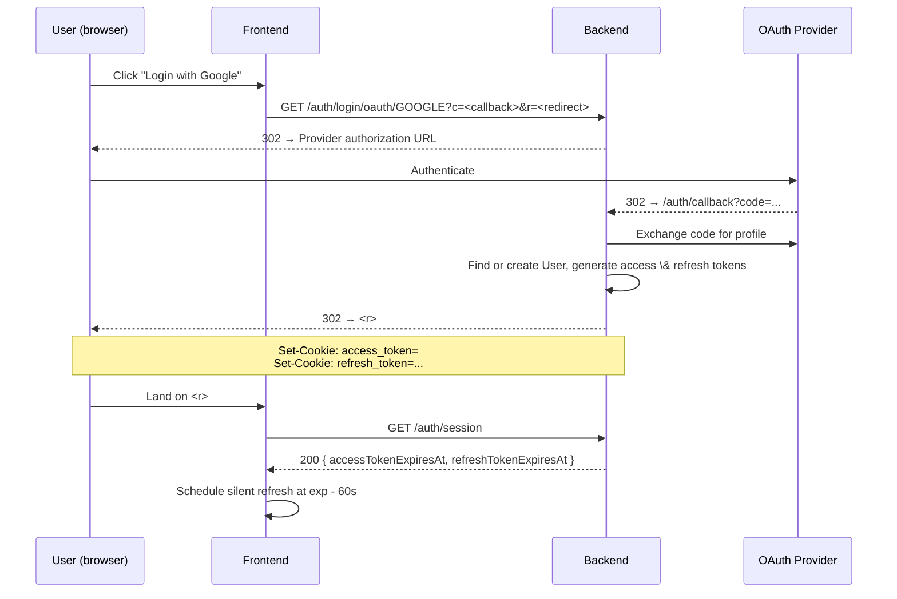
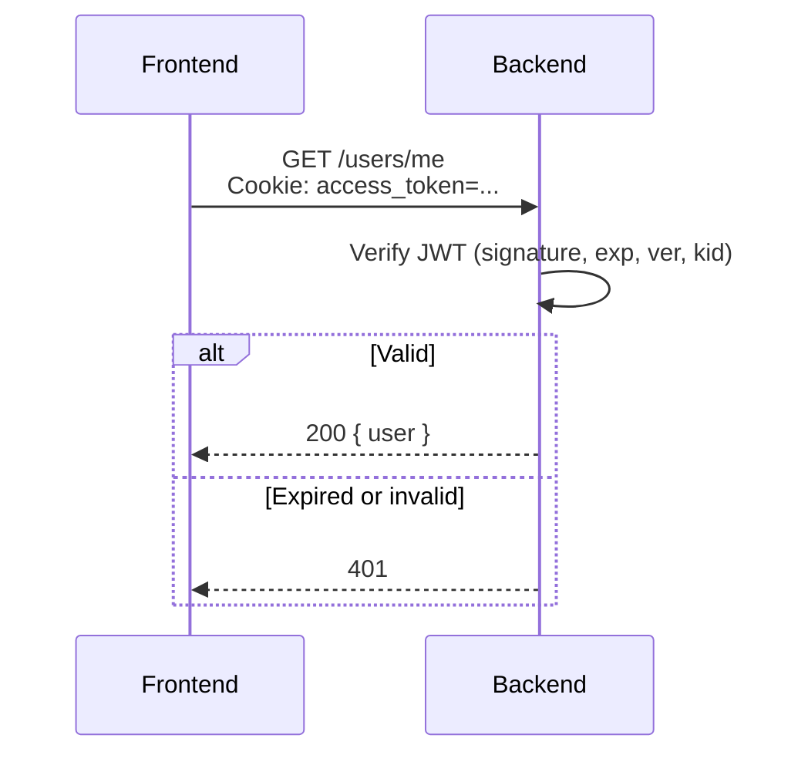
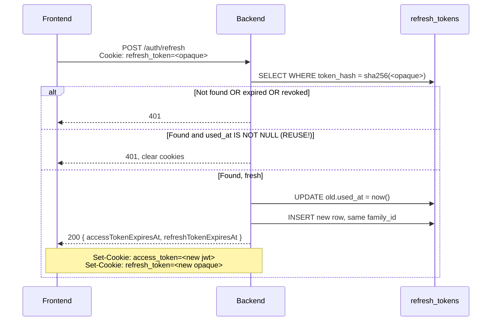
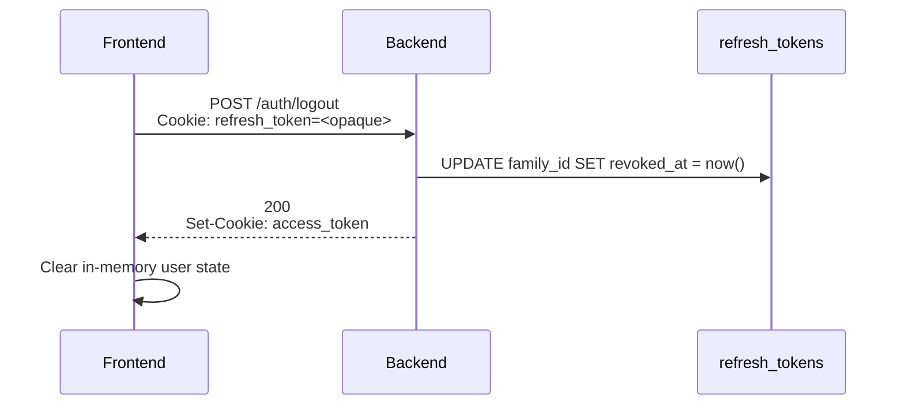

# SciEdu Authentication Flow

Type: Tech Spec
Status: Draft
Author: 郭慕天
Products: SciEdu (https://www.notion.so/SciEdu-2f27dadd8040801d8d77d2c4829c7015?pvs=21)
Created time: May 6, 2026 11:21 AM
Last edited time: May 6, 2026 11:39 AM

## Overview

This document specifies a fully backend-managed, cookie-based JWT authentication scheme. The defining property of this design is that **no token is ever exposed to JavaScript**. The browser holds the credentials in `HttpOnly` cookies, the backend issues and rotates them, and the frontend's only role in the auth lifecycle is to decide *when* to call `/auth/refresh` and how to recover after long absences.

## Goals

1. **HTTP-only cookies only.** Access and refresh tokens are never readable from the page context. A successful XSS does not equal a stolen session.
2. **Short access token (15 min), long refresh token (30 days).** Compromise of an access token has bounded blast radius; the refresh token is revocable.
3. **Seamless UX.** The user does not see 401s. The frontend silently refreshes before expiry and recovers cleanly when the laptop wakes from a week-long sleep.
4. **Stateless verification on the hot path.** Verifying an access token requires no DB round trip — JWT signature only. Refresh and logout are the only auth-table reads.

## Token Architecture

### Access Token

| Property | Value |
| --- | --- |
| Format | JWT, signed `HS256` (single backend) or `RS256`/`EdDSA` (multi-service) |
| Lifetime | **15 minutes** from issuance |
| Storage | `access_token` cookie |
| Backend state | None — verified statelessly via signature |
| Cookie Attrs | HttpOnly; Secure (only in prod); SameSite=Lax; Path=/; Max-Age=900 |

`SameSite=Lax` (not `Strict`) on the access cookie so that top-level navigations from external links (email confirmations, OAuth redirects) carry the session.

**Claims:**

```json
{
  "sub": "3c5fa073-7b97-43a3-bc44-ddc98f390a08",  // user uuid
  "iat": 1735689000,
  "exp": 1735689900,                              // iat + 15*60
}
```

### Refresh Token

The refresh token is **not** a JWT. It carries no claims. The server alone knows what it means. This makes revocation cheap (delete or mark a row) and theft detection possible (we can tell when the same row is presented twice).

| Property | Value |
| --- | --- |
| Format | UUID |
| Lifetime | **30 days** from issuance, **non-sliding** |
| Storage | `refresh_token` cookie |
| Backend state | Row in `refresh_tokens` table, token stored as SHA-256 hash |
| Cookie Attrs | HttpOnly; Secure (prod); SameSite=Strict; Path=/auth; Max-Age=2592000 |

Two important narrowings beyond the access cookie:

- **`Path=/auth`** — the refresh cookie is sent only to `/auth/*` endpoints. Application code never sees it; only the auth handlers do. Reduces accidental logging and exposure surface.
- **`SameSite=Strict`** — the refresh cookie is never sent on cross-site requests, including top-level navigations. There is no legitimate cross-site flow that needs the refresh token.

### Why two tokens?

Stateless JWT for the hot path (every API call) and a stateful opaque token for the rare path (refresh, ~96 times per 30-day window per user). We get cheap verification *and* revocation/rotation/theft-detection. A single stateful access token would couple every API call to the auth DB; a single stateless 30-day JWT would be unrevocable.

## Authentication Flows

### OAuth Login



The frontend learns expiry timestamps via `/auth/session` — it cannot decode the JWT itself. This is the single piece of metadata it needs to drive the silent-refresh schedule.

### Authenticated Request



No DB read on the happy path. Verification is signature + claim checks.

### Token Refresh



Two cookies are reissued on every refresh. The old refresh token is marked `used_at` but kept (not deleted) so we can detect replay.

### Logout



Logout revokes the entire refresh family, not just the current token. A user who clicks "log out" expects every chain that descends from that login to die.

The access token is not blocklisted — it expires on its own within 15 minutes. If that window is unacceptable for a particular operation (rare), the operation can do a short-circuit DB check on `jti`.

## Frontend Session Management

The frontend never sees the token strings. It manages auth via three signals:

1. **HTTP status codes** — 401 means "session probably needs refresh".
2. **Session metadata from `/auth/session` and `/auth/refresh`** — the `accessTokenExpiresAt` timestamp drives the silent-refresh timer.
3. **Browser lifecycle events** — `visibilitychange`, `focus`, and `online` for recovery after long absences.

### Initial Page Load

```tsx
// Pseudocode
async function bootstrapAuth() {
  try {
    const { user } = await api.get('/users/me');
    const session = await api.get('/auth/session');
    authStore.set({ status: 'authed', user, session });
    scheduleRefresh(session.accessTokenExpiresAt);
  } catch (e) {
    if (e.status === 401) {
      // Try refresh once before declaring the user logged out.
      try {
        const session = await api.post('/auth/refresh');
        const { user } = await api.get('/users/me');
        authStore.set({ status: 'authed', user, session });
        scheduleRefresh(session.accessTokenExpiresAt);
      } catch {
        authStore.set({ status: 'anon' });
      }
    } else {
      authStore.set({ status: 'unknown', error: e });
    }
  }
}
```

Calling `/users/me` on boot is the single source of truth: we don't trust any client-side cache to tell us we're logged in.

### Proactive Keepalive (Silent Refresh)

The frontend schedules a single `setTimeout` to fire **60 seconds before** the access token expires. This buffer absorbs clock skew and slow networks.

```tsx
let refreshTimer: number | null = null;

function scheduleRefresh(accessTokenExpiresAt: number) {
  if (refreshTimer) clearTimeout(refreshTimer);
  const msUntilRefresh = accessTokenExpiresAt * 1000 - Date.now() - 60_000;
  refreshTimer = setTimeout(silentRefresh, Math.max(msUntilRefresh, 0));
}

async function silentRefresh() {
  try {
    const session = await api.post('/auth/refresh');
    scheduleRefresh(session.accessTokenExpiresAt);
    broadcast({ type: 'refreshed', session });
  } catch (e) {
    if (e.status === 401) {
      authStore.set({ status: 'anon' });
      navigate('/login');
    } else {
      // Network blip — retry with capped backoff.
      retryRefresh();
    }
  }
}
```

Critical properties:

- **`setTimeout`, not `setInterval`.** We re-arm after each refresh based on the new expiry. If the user's tab is throttled or the system suspends, `setInterval` accumulates pending fires; `setTimeout` does not.
- **One timer per app instance, not per tab.**
- **No keepalive while the tab is hidden** — we let the timer run, but if the tab is hidden when it fires, we defer.

### Reactive Refresh (401 Interceptor)

Even with proactive refresh, 401s happen — clock skew, a missed refresh while suspended, a server-side revocation. A single interceptor handles them with **single-flight** semantics so a burst of concurrent requests doesn't trigger N parallel refreshes:

```tsx
let inflightRefresh: Promise<void> | null = null;

async function fetchWithAuth(input: RequestInfo, init?: RequestInit) {
  const res = await fetch(input, { credentials: 'include', ...init });
  if (res.status !== 401) return res;

  if (!inflightRefresh) {
    inflightRefresh = api.post('/auth/refresh')
      .then(session => { scheduleRefresh(session.accessTokenExpiresAt); })
      .finally(() => { inflightRefresh = null; });
  }

  try {
    await inflightRefresh;
    return fetch(input, { credentials: 'include', ...init });  // retry once
  } catch {
    authStore.set({ status: 'anon' });
    navigate('/login');
    return res;
  }
}
```

Only one retry. If the retry also 401s, give up and bounce to login — the refresh token is dead.

### Long-Absence Recovery

Three browser events tell us the user has come back after being away:

| Event | When it fires |
| --- | --- |
| `visibilitychange` (→ visible) | Tab becomes foreground |
| `focus` (window) | Window gets focus |
| `online` | Network reconnects |

On any of these we:

1. Compare `Date.now()` to the scheduled refresh time. If the timer should already have fired but didn't (suspended timer), fire it now.
2. If the access token's `expiresAt` is already in the past, just call `/auth/refresh` immediately rather than waiting on the schedule.
3. If the refresh fails with 401, the refresh token has expired (>30 days away, or revoked) — bounce to login.

```tsx
function onResume() {
  const exp = authStore.get().session?.accessTokenExpiresAt;
  if (!exp) return;
  if (Date.now() >= exp * 1000 - 60_000) {
    silentRefresh();
  }
}

document.addEventListener('visibilitychange', () => {
  if (document.visibilityState === 'visible') onResume();
});
window.addEventListener('focus', onResume);
window.addEventListener('online', onResume);
```

This is the mechanism that handles the canonical "user closes lid Friday evening, opens it Tuesday morning" case. The 30-day refresh window is generous enough that any reasonable absence is covered; if the user has been gone longer, login is the right outcome.

### Cross-Tab Coordination

If the user has the app open in three tabs, we want **one** silent refresh, not three. Without coordination, three tabs will independently fire refresh at the same moment, and only one of the three new refresh tokens will be the latest — the other two are now "used" and will trigger reuse-detection on the next refresh.

Use a `BroadcastChannel`:

```tsx
const channel = new BroadcastChannel('auth');

channel.onmessage = (ev) => {
  if (ev.data.type === 'refreshed') {
    scheduleRefresh(ev.data.session.accessTokenExpiresAt);
  } else if (ev.data.type === 'logout') {
    authStore.set({ status: 'anon' });
  }
};

// In silentRefresh and logout, broadcast after success:
channel.postMessage({ type: 'refreshed', session });
```

A "leader tab" pattern (using a `Web Lock`) is cleaner still but adds complexity. The single-flight guard plus broadcasting on success is enough in practice — even if two tabs do refresh in the same instant, the second will lose the race against the rotation, get a 401 from the reuse-detection path, and the broadcast from the winner will resync it.

> **Implementation note:** the reuse-detection path is *defensive*. In normal multi-tab operation we should never trip it. If we observe family-revocations on healthy users, the cross-tab coordination needs more work.
> 

## Implementation Notes

### JWT signing keys

- Single-service deployment: HS256 with a 256-bit secret in the secrets store. Rotate quarterly.
- Always include `kid` in the header. Roll keys with overlap: key N+1 active for signing, key N still accepted for verification for one full access-token lifetime (15 min), then retired.

### Clock skew

Allow ±60s clock skew when verifying `exp` and `nbf`. The 60s pre-expiry refresh buffer on the frontend makes this rarely matter, but it's free insurance.

### CORS

If the frontend is hosted on a different origin from the API (it shouldn't be, but might be in dev):

```
Access-Control-Allow-Origin: https://app.sdc.example   (specific, never *)
Access-Control-Allow-Credentials: true
Access-Control-Allow-Headers: Content-Type, X-Requested-With
```

And the frontend `fetch` calls must use `credentials: 'include'`.

For production, host frontend and API on the same eTLD+1 (e.g., `app.sdc.example` and `api.sdc.example`). This makes `SameSite=Strict` work and removes CORS complexity entirely.

### Logging

- Never log the raw `refresh_token` cookie value. Strip it in middleware before request logging.
- Log `family_id` and `id` of refresh-token rows on rotation and revocation events.
- Reuse-detection events should fire a metric (`auth.refresh.reuse_detected`) and ideally an alert at any non-zero rate.

### Rate limiting

- `/auth/refresh`: 60 requests / IP / minute. Legitimate clients hit this ~96 times in a 30-day month per session, so a per-minute cap is generous.
- `/auth/login/oauth/*`: 30 / IP / minute.
- `/auth/logout`: unlimited.

## Appendix A: Complete request lifecycle (worked example)

A user logs in Monday at 10:00, closes the laptop at 18:00, opens it Wednesday at 09:00.

| Time | Event | What happens |
| --- | --- | --- |
| Mon 10:00:00 | OAuth completes | `R_login` issued; access JWT exp = 10:15:00; frontend schedules silent refresh for 10:14:00 |
| Mon 10:14:00 | Silent refresh fires | `R_login` → `used`; `R2` issued; new JWT exp = 10:29:00; timer rescheduled for 10:28:00 |
| Mon 10:14:00 → 18:00:00 | Active use | ~31 silent refreshes, family chain `R_login → R2 → ... → R32` |
| Mon 18:00:00 | Laptop closes | Tab suspends; `setTimeout` does not fire while suspended on most platforms |
| Wed 09:00:00 | Laptop opens | `visibilitychange` → visible. `onResume()` checks: `accessTokenExpiresAt` is in the past (Mon ~18:14). Calls `/auth/refresh` immediately. |
| Wed 09:00:01 | Refresh succeeds | `R32` was the active token at suspend; it's still valid (not yet 30 days old); `R33` issued; user keeps working. |
| ... | ... | ... |
| Wed 09:00:00 + 30d | Refresh fails | `R_login`'s family hits its absolute 30-day cap; `/auth/refresh` returns 401; frontend bounces to login. |

The user's experience: log in once on Monday, work uninterrupted for nearly a month before being asked to log in again — without ever holding a token that JavaScript can read.