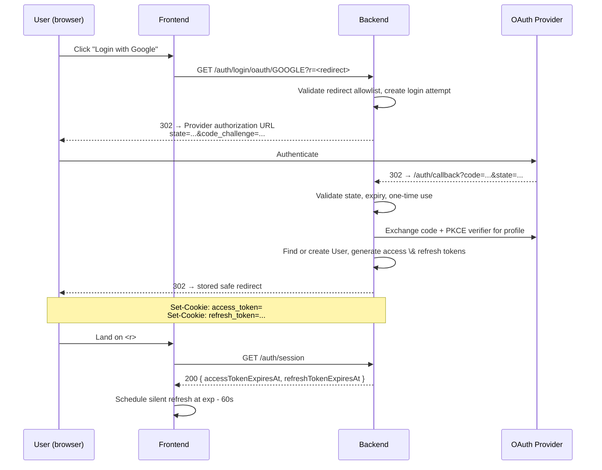
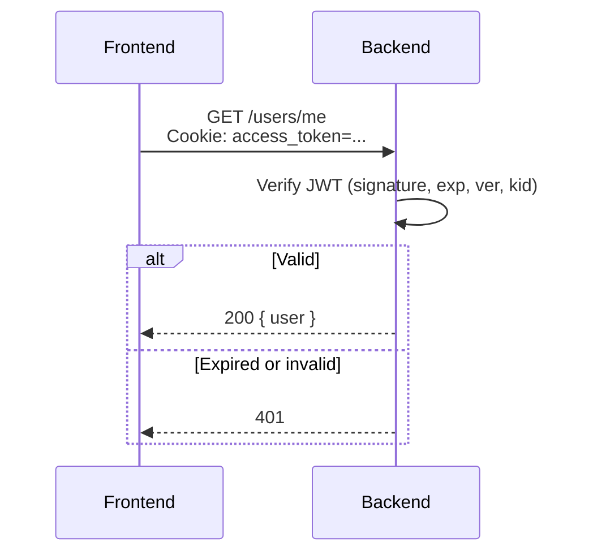
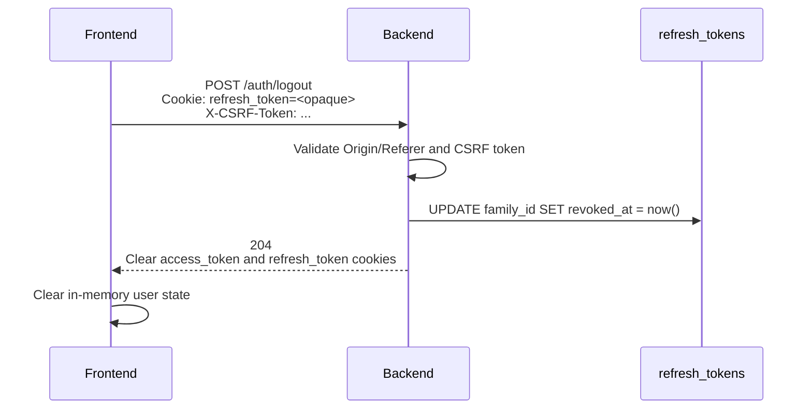

# SciEdu Authentication Flow

Type: Tech Spec
Status: Draft
Author: 郭慕天
Products: SciEdu (https://www.notion.so/SciEdu-2f27dadd8040801d8d77d2c4829c7015?pvs=21)
Created time: May 6, 2026 11:21 AM
Last edited time: May 13, 2026 10:30 AM

## Overview

This document specifies a fully backend-managed, cookie-based JWT authentication scheme. The defining property of this design is that **no token is ever exposed to JavaScript**. The browser holds the credentials in `HttpOnly` cookies, the backend issues and rotates them, and the frontend's only role in the auth lifecycle is to decide *when* to call `/auth/refresh` and how to recover after long absences.

> **Contract note:** this document is the target auth design. Before implementation, `service/auth.tsp` must be updated to match it: auth endpoints must not return token strings in response bodies, and refresh tokens must not appear in path parameters or query strings.

## Goals

1. **HTTP-only cookies only.** Access and refresh tokens are never readable from the page context. A successful XSS does not equal a stolen session.
2. **Short access token (15 min), long refresh token (30 days).** Compromise of an access token has bounded blast radius; the refresh token is revocable.
3. **Seamless UX.** The user does not see 401s. The frontend silently refreshes before expiry and recovers cleanly when the laptop wakes from a week-long sleep.
4. **Stateless verification on the hot path.** Verifying an access token requires no DB round trip — JWT signature only. Refresh and logout are the only auth-table reads.

## Non-Negotiable Security Requirements

1. **OAuth requests must be bound to a server-side login attempt.** Generate and validate `state`; use PKCE (`code_verifier`/`code_challenge`) when supported by the provider; reject callbacks whose `state` is missing, expired, already used, or does not match the stored login attempt.
2. **Redirects must be allowlisted.** The backend must never redirect to an arbitrary `r`/`callback` URL. Store a validated relative path or allowlisted frontend origin in the login attempt and use only that value after callback.
3. **Cookie-auth state changes need CSRF protection.** `POST /auth/refresh`, `POST /auth/logout`, and every authenticated non-idempotent application endpoint must validate an Origin/Referer header and a CSRF token, unless the endpoint has an explicit stronger mitigation.
4. **Refresh-token rotation must be atomic.** Token lookup, replay detection, marking the old token used, inserting the new token, and optional family revocation must happen in one transaction with row-level locking or an equivalent compare-and-swap condition.
5. **Replay detection is a security event, not normal control flow.** Benign client concurrency must be handled by client coordination and backend race tolerance; true reuse of an already-rotated refresh token should revoke the token family and emit telemetry.

## Token Architecture

### Access Token

| Property | Value |
| --- | --- |
| Format | JWT, signed `HS256` (single backend) or `RS256`/`EdDSA` (multi-service) |
| Lifetime | **15 minutes** from issuance |
| Storage | `access_token` cookie |
| Backend state | None — verified statelessly via signature |
| Cookie Attrs | HttpOnly; Secure (only in prod); SameSite=Lax; Path=/; Max-Age=900 |

`SameSite=Lax` (not `Strict`) on the access cookie so that top-level navigations from external links (email confirmations, OAuth redirects) carry the session.

**Claims:**

```json
{
  "sub": "3c5fa073-7b97-43a3-bc44-ddc98f390a08",  // user uuid
  "iss": "https://api.sdc.example",
  "aud": "sciedu-api",
  "jti": "8b6467a9-24c7-42bc-b8c6-0459ef0aa7f8",
  "iat": 1735689000,
  "nbf": 1735689000,
  "exp": 1735689900,                              // iat + 15*60
}
```

Required verification checks:

- Signature and algorithm match the configured key for the JWT header `kid`.
- `iss`, `aud`, `sub`, `iat`, `nbf`, and `exp` are present and valid.
- `sub` is a UUID.
- `exp` and `nbf` are evaluated with the clock-skew policy below.

### Refresh Token

The refresh token is **not** a JWT. It carries no claims. The server alone knows what it means. This makes revocation cheap (delete or mark a row) and theft detection possible (we can tell when the same row is presented twice).

| Property | Value |
| --- | --- |
| Format | UUID |
| Lifetime | **30 days** from issuance, **non-sliding** |
| Storage | `refresh_token` cookie |
| Backend state | Row in `refresh_tokens` table, token stored as SHA-256 hash |
| Cookie Attrs | HttpOnly; Secure (prod); SameSite=Strict; Path=/auth; Max-Age=2592000 |

Two important narrowings beyond the access cookie:

- **`Path=/auth`** — the refresh cookie is sent only to `/auth/*` endpoints. Application code never sees it; only the auth handlers do. Reduces accidental logging and exposure surface.
- **`SameSite=Strict`** — the refresh cookie is never sent on cross-site requests, including top-level navigations. There is no legitimate cross-site flow that needs the refresh token.

The opaque refresh token must be generated from cryptographically secure randomness. A UUIDv4 is acceptable only if it is produced by a CSPRNG; a 256-bit random value encoded as base64url is preferred. Store only `sha256(refresh_token)` in the database.

### Why two tokens?

Stateless JWT for the hot path (every API call) and a stateful opaque token for the rare path (refresh, ~96 times per 30-day window per user). We get cheap verification *and* revocation/rotation/theft-detection. A single stateful access token would couple every API call to the auth DB; a single stateless 30-day JWT would be unrevocable.

## Authentication Flows

### OAuth Login



The frontend learns expiry timestamps via `/auth/session` — it cannot decode the JWT itself. This is the single piece of metadata it needs to drive the silent-refresh schedule.

OAuth callback validation rules:

- `state` must be high entropy, stored server-side or in an encrypted/signed `HttpOnly` login-attempt cookie, and expire quickly, e.g. 10 minutes.
- A successful callback must consume the login attempt exactly once.
- The backend must not trust `r` from the callback request. The post-login redirect must come from the validated login attempt created before redirecting to the provider.
- Only relative frontend paths such as `/dashboard` or explicitly allowlisted frontend origins are valid redirect targets.
- OAuth errors from the provider should redirect to a safe login error page without leaking provider details or raw query values.

### Authenticated Request



No DB read on the happy path. Verification is signature + claim checks.

### Token Refresh

```mermaid
sequenceDiagram
    participant F as Frontend
    participant B as Backend
    participant DB as refresh_tokens
    F->>B: POST /auth/refresh<br/>Cookie: refresh_token=<opaque><br/>X-CSRF-Token: ...
    B->>B: Validate Origin/Referer and CSRF token
    B->>DB: BEGIN; SELECT ... FOR UPDATE WHERE token_hash = sha256(<opaque>)
    alt Not found OR expired OR revoked
        B->>DB: ROLLBACK
        B-->>F: 401, clear cookies
    else Found and used_at IS NOT NULL  (REUSE!)
        B->>DB: Revoke token family, COMMIT
        B-->>F: 401, clear cookies
    else Found, fresh
        B->>DB: UPDATE old.used_at = now()
        B->>DB: INSERT new row, same family_id
        B->>DB: COMMIT
        B-->>F: 200 { accessTokenExpiresAt, refreshTokenExpiresAt }
        Note over B,F: Set-Cookie: access_token=<new jwt><br/>Set-Cookie: refresh_token=<new opaque>
    end
```

Two cookies are reissued on every refresh. The old refresh token is marked `used_at` but kept (not deleted) so we can detect replay.

Refresh rotation rules:

- Perform rotation in a single transaction.
- Lock the matching refresh-token row with `SELECT ... FOR UPDATE`, or use an atomic `UPDATE ... WHERE used_at IS NULL AND revoked_at IS NULL AND expires_at > now() RETURNING ...`.
- Revoke the whole family when an already-used token is presented outside the configured concurrency grace behavior.
- Clear both `access_token` and `refresh_token` cookies on all 401 refresh outcomes.
- Return only expiry metadata and user/session state. Do not return token strings.
- Use a short idempotency/grace strategy for duplicate client requests from the same current token, e.g. allow a second request within a few seconds to receive the already-issued successor without revoking the family. This protects normal browser concurrency without weakening replay detection for older tokens.

### Logout



Logout revokes the entire refresh family, not just the current token. A user who clicks "log out" expects every chain that descends from that login to die.

The access token is not blocklisted — it expires on its own within 15 minutes. If that window is unacceptable for a particular operation (rare), the operation can do a short-circuit DB check on `jti`.

Logout should be idempotent: missing, expired, or already-revoked refresh cookies should still result in cleared cookies and a successful no-content response, unless the request fails CSRF validation.

## Frontend Session Management

The frontend never sees the token strings. It manages auth via three signals:

1. **HTTP status codes** — 401 means "session probably needs refresh".
2. **Session metadata from `/auth/session` and `/auth/refresh`** — the `accessTokenExpiresAt` timestamp drives the silent-refresh timer.
3. **Browser lifecycle events** — `visibilitychange`, `focus`, and `online` for recovery after long absences.

The frontend must also keep a non-HttpOnly CSRF token value, obtained from a safe backend endpoint or a readable CSRF cookie. This token is not an auth credential; it only proves that the request came from the app's JavaScript context. All state-changing requests include it as `X-CSRF-Token`.

### Initial Page Load

```tsx
// Pseudocode
async function bootstrapAuth() {
  try {
    const { user } = await api.get('/users/me');
    const session = await api.get('/auth/session');
    authStore.set({ status: 'authed', user, session });
    scheduleRefresh(session.accessTokenExpiresAt);
  } catch (e) {
    if (e.status === 401) {
      // Try refresh once before declaring the user logged out.
      try {
        const session = await api.post('/auth/refresh', { csrf: true });
        const { user } = await api.get('/users/me');
        authStore.set({ status: 'authed', user, session });
        scheduleRefresh(session.accessTokenExpiresAt);
      } catch {
        authStore.set({ status: 'anon' });
      }
    } else {
      authStore.set({ status: 'unknown', error: e });
    }
  }
}
```

Calling `/users/me` on boot is the single source of truth: we don't trust any client-side cache to tell us we're logged in.

### Proactive Keepalive (Silent Refresh)

The frontend schedules a single `setTimeout` to fire **60 seconds before** the access token expires. This buffer absorbs clock skew and slow networks.

```tsx
let refreshTimer: number | null = null;

function scheduleRefresh(accessTokenExpiresAt: number) {
  if (refreshTimer) clearTimeout(refreshTimer);
  const msUntilRefresh = accessTokenExpiresAt * 1000 - Date.now() - 60_000;
  refreshTimer = setTimeout(silentRefresh, Math.max(msUntilRefresh, 0));
}

async function silentRefresh() {
  if (document.visibilityState === 'hidden') return;

  try {
    const session = await api.post('/auth/refresh', { csrf: true });
    scheduleRefresh(session.accessTokenExpiresAt);
    broadcast({ type: 'refreshed', session });
  } catch (e) {
    if (e.status === 401) {
      authStore.set({ status: 'anon' });
      navigate('/login');
    } else {
      // Network blip — retry with capped backoff.
      retryRefresh();
    }
  }
}
```

Critical properties:

- **`setTimeout`, not `setInterval`.** We re-arm after each refresh based on the new expiry. If the user's tab is throttled or the system suspends, `setInterval` accumulates pending fires; `setTimeout` does not.
- **One timer per app instance, not per tab.**
- **No keepalive while the tab is hidden** — the timer may fire, but `silentRefresh()` exits without rotating the refresh token. Resume events below perform catch-up refresh when the user returns.

### Reactive Refresh (401 Interceptor)

Even with proactive refresh, 401s happen — clock skew, a missed refresh while suspended, a server-side revocation. A single interceptor handles them with **single-flight** semantics so a burst of concurrent requests doesn't trigger N parallel refreshes:

```tsx
let inflightRefresh: Promise<void> | null = null;

async function fetchWithAuth(input: RequestInfo, init?: RequestInit) {
  const res = await fetch(input, { credentials: 'include', ...init });
  if (res.status !== 401) return res;

  if (!inflightRefresh) {
    inflightRefresh = api.post('/auth/refresh', { csrf: true })
      .then(session => { scheduleRefresh(session.accessTokenExpiresAt); })
      .finally(() => { inflightRefresh = null; });
  }

  try {
    await inflightRefresh;
    return fetch(input, { credentials: 'include', ...init });  // retry once
  } catch {
    authStore.set({ status: 'anon' });
    navigate('/login');
    return res;
  }
}
```

Only one retry. If the retry also 401s, give up and bounce to login — the refresh token is dead.

### Long-Absence Recovery

Three browser events tell us the user has come back after being away:

| Event | When it fires |
| --- | --- |
| `visibilitychange` (→ visible) | Tab becomes foreground |
| `focus` (window) | Window gets focus |
| `online` | Network reconnects |

On any of these we:

1. Compare `Date.now()` to the scheduled refresh time. If the timer should already have fired but didn't (suspended timer), fire it now.
2. If the access token's `expiresAt` is already in the past, just call `/auth/refresh` immediately rather than waiting on the schedule.
3. If the refresh fails with 401, the refresh token has expired (>30 days away, or revoked) — bounce to login.

```tsx
function onResume() {
  const exp = authStore.get().session?.accessTokenExpiresAt;
  if (!exp) return;
  if (Date.now() >= exp * 1000 - 60_000) {
    silentRefresh();
  }
}

document.addEventListener('visibilitychange', () => {
  if (document.visibilityState === 'visible') onResume();
});
window.addEventListener('focus', onResume);
window.addEventListener('online', onResume);
```

This is the mechanism that handles the canonical "user closes lid Friday evening, opens it Tuesday morning" case. The 30-day refresh window is generous enough that any reasonable absence is covered; if the user has been gone longer, login is the right outcome.

### Cross-Tab Coordination

If the user has the app open in three tabs, we want **one** silent refresh, not three. Without coordination, three tabs will independently fire refresh at the same moment, and only one of the three new refresh tokens will be the latest — the other two are now "used" and will trigger reuse-detection on the next refresh.

Use a `BroadcastChannel`:

```tsx
const channel = new BroadcastChannel('auth');

channel.onmessage = (ev) => {
  if (ev.data.type === 'refreshed') {
    scheduleRefresh(ev.data.session.accessTokenExpiresAt);
  } else if (ev.data.type === 'logout') {
    authStore.set({ status: 'anon' });
  }
};

// In silentRefresh and logout, broadcast after success:
channel.postMessage({ type: 'refreshed', session });
```

Broadcasting is not a lock. It only informs other tabs after one tab has already refreshed.

Use a `Web Lock` around refresh when available:

```tsx
async function refreshWithTabLock() {
  if ('locks' in navigator) {
    return navigator.locks.request('sciedu-auth-refresh', { mode: 'exclusive' }, async () => {
      return api.post('/auth/refresh', { csrf: true });
    });
  }

  return api.post('/auth/refresh', { csrf: true });
}
```

The backend must still tolerate duplicate refresh requests from the same current token because not every browser supports Web Locks and tabs can race before a broadcast is received. The recommended behavior is:

- If a fresh token is rotated successfully, issue a successor and record enough metadata to identify it.
- If the same token is presented again within a short grace window, return the same successor expiry metadata and set the successor cookies again.
- If a token older than the current grace window is presented after `used_at` is set, treat it as reuse, revoke the family, clear cookies, and emit telemetry.

> **Implementation note:** the reuse-detection path is *defensive*. In normal multi-tab operation we should never trip it. If we observe family-revocations on healthy users, the cross-tab coordination needs more work.
> 

## Implementation Notes

### JWT signing keys

- Single-service deployment: HS256 with a 256-bit secret in the secrets store. Rotate quarterly.
- Always include `kid` in the header. Roll keys with overlap: key N+1 active for signing, key N still accepted for verification for one full access-token lifetime (15 min), then retired.

### Clock skew

Allow ±60s clock skew when verifying `exp` and `nbf`. The 60s pre-expiry refresh buffer on the frontend makes this rarely matter, but it's free insurance.

### CORS

If the frontend is hosted on a different origin from the API (it shouldn't be, but might be in dev):

```
Access-Control-Allow-Origin: https://app.sdc.example   (specific, never *)
Access-Control-Allow-Credentials: true
Access-Control-Allow-Headers: Content-Type, X-Requested-With, X-CSRF-Token
```

And the frontend `fetch` calls must use `credentials: 'include'`.

For production, host frontend and API on the same eTLD+1 (e.g., `app.sdc.example` and `api.sdc.example`). This makes `SameSite=Strict` work and removes CORS complexity entirely.

### CSRF

Cookie authentication means the browser can attach credentials automatically, so state-changing endpoints must reject requests that do not prove they came from the SciEdu frontend.

Required checks:

- Validate `Origin` for all state-changing requests when present.
- Fall back to `Referer` only when `Origin` is absent, and require HTTPS plus an allowlisted origin.
- Require `X-CSRF-Token` for `POST`, `PUT`, `PATCH`, and `DELETE` endpoints that use cookie auth.
- Bind the CSRF token to the session or sign it server-side. A double-submit cookie is acceptable only if the token is signed or otherwise bound to the refresh-token family.
- Do not allow simple-form CSRF bypasses. Require `Content-Type: application/json` for JSON endpoints and reject unexpected content types.

### Logging

- Never log the raw `refresh_token` cookie value. Strip it in middleware before request logging.
- Never log `Cookie`, `Authorization`, OAuth `code`, OAuth `state`, or CSRF token values.
- Log `family_id` and `id` of refresh-token rows on rotation and revocation events.
- Reuse-detection events should fire a metric (`auth.refresh.reuse_detected`) and ideally an alert at any non-zero rate.

### Rate limiting

- `/auth/refresh`: 60 requests / IP / minute. Legitimate clients hit this ~96 times in a 30-day month per session, so a per-minute cap is generous.
- `/auth/login/oauth/*`: 30 / IP / minute.
- `/auth/callback`: 60 / IP / minute, plus strict `state` validation.
- `/auth/logout`: 60 / IP / minute. Logout is idempotent, but it should not be fully unlimited.

### Cookie clearing

Clear cookies by setting the same `Name`, `Path`, `Domain` if used, `Secure`, and `SameSite` attributes as the original cookie with `Max-Age=0`. Because the refresh cookie uses `Path=/auth`, a generic clear at `Path=/` will not remove it.

### TypeSpec alignment

Before implementing this design, update `service/auth.tsp` so the generated OpenAPI contract reflects the cookie-based flow:

- Replace `AuthToken` responses with session metadata, e.g. `{ accessTokenExpiresAt, refreshTokenExpiresAt }`.
- Replace `POST /auth/refreshToken/{refreshToken}` with `POST /auth/refresh`; the refresh token comes only from the `HttpOnly` cookie.
- Add `POST /auth/logout`, `GET /auth/session`, `GET /auth/login/oauth/{provider}`, and `GET /auth/callback` operations.
- Document cookie behavior and CSRF requirements in operation descriptions.
- Ensure development-only login either follows the same cookie-setting behavior or is excluded from production builds.

## Appendix A: Complete request lifecycle (worked example)

A user logs in Monday at 10:00, closes the laptop at 18:00, opens it Wednesday at 09:00.

| Time | Event | What happens |
| --- | --- | --- |
| Mon 10:00:00 | OAuth completes | `R_login` issued; access JWT exp = 10:15:00; frontend schedules silent refresh for 10:14:00 |
| Mon 10:14:00 | Silent refresh fires | `R_login` → `used`; `R2` issued; new JWT exp = 10:29:00; timer rescheduled for 10:28:00 |
| Mon 10:14:00 → 18:00:00 | Active use | ~31 silent refreshes, family chain `R_login → R2 → ... → R32` |
| Mon 18:00:00 | Laptop closes | Tab suspends; `setTimeout` does not fire while suspended on most platforms |
| Wed 09:00:00 | Laptop opens | `visibilitychange` → visible. `onResume()` checks: `accessTokenExpiresAt` is in the past (Mon ~18:14). Calls `/auth/refresh` immediately. |
| Wed 09:00:01 | Refresh succeeds | `R32` was the active token at suspend; it's still valid (not yet 30 days old); `R33` issued; user keeps working. |
| ... | ... | ... |
| Wed 09:00:00 + 30d | Refresh fails | `R_login`'s family hits its absolute 30-day cap; `/auth/refresh` returns 401; frontend bounces to login. |

The user's experience: log in once on Monday, work uninterrupted for nearly a month before being asked to log in again — without ever holding a token that JavaScript can read.
